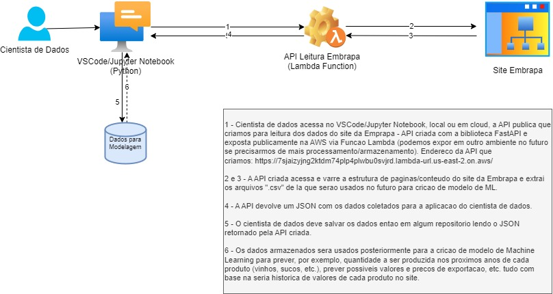

# Fiap Tech Challenge 01
## API Banco de dados de uva, vinho e derivados

### Descrição
Está API foi desenvolvida para retornar os dados sobre vitivicultura disponiveis no site da [Embrapa](http://vitibrasil.cnpuv.embrapa.br/).
A API fornece acesso as categorias de produção, processamento, comercialização, importação e exportação de uvas, vinhos e derivados.
O objetivo da API é exibir os dados da categoria desejada.

### Estrutura de arquivos do Projeto

Os arquivos do projeto estão estruturados da seguinte forma:

- main.py: Arquivo principal que lê arquivos JSON e roda a API.
- listaURLs.py: Arquivo com o objetivo de extrair os links que contém os dados em CSV das categorias do site da Embrapa.
- scrapper.py: Arquivo que baixa o conteúdo CSV dos links gerados em listaURLs.py e salva na pasta src/csv para organização.
- tabelas.py: Arquivo destinado a ler os arquivos CSV baixados e salva-los em JSON na pasta src/json para melhor leitura dos dados na API.
- lista_urls.json: Arquivo gerado por listaURLs.py com todos os links das categorias que contém arquivos csv.
- csv/: Diretório contendo arquivos csv extraídos pelo scrapper.py
- json/: Diretório contendo arquivos json convertidos pelo tabelas.py

O projeto da API retoma os dados do site da Embrapa sobre Vitivinicultura. O web scraping baixa os arquivos csv que alimentam as tabelas no site, onde são convertidos posteriormente para json e finalmente lidos internamente pela API. Foi criado um filtro apenas para as categorias que tem subcategorias, indicando qual opção retorna cada tabela, tendo um tratamento simples de erro 500, caso a opção digitada não seja uma das disponiveis. Todos os comandos GET retomam todos os dados da categoria selecionada.

### Dependências
- FastAPI
- Uvicorn
- Anytree
- JSON
- Typing
- Requests
- BeautifulSoup4
- Urllib
- Re
- Pandas

### Passo a passo

1. Clone o repositório:
```
https://github.com/victorog17/fiap_tech_challenge_01.git
cd repositorio
```

2. Crie um ambiente virtual:
```
python -m venv venv
venv\Scripts\activate  # No Windows 
```

3. Instação das dependências:
```
pip install -r requirements.txt

```
4. Entrar diretório /src
```
cd src
```

4. Ordem de execução dos scripts:
```
python listaURLs.py
python scrapper.py
python tabelas.py
```

5. Execução da API:
```
uvicorn main:app --reload
```

### Referencia Estrutura de Categorias

- Categoria Produção
- Categoria Processamento
  - Subcategoria Viníferas
  - Subcategoria Americanas e híbridas
  - Subcategoria Uvas de mesa
  - Subcategoria Sem classificação
- Categoria Comercialização
- Categoria Importação
  - Subcategoria Vinhos de mesa
  - Subcategoria Espumantes
  - Subcategoria Uvas frescas
  - Subcategoria Uvas passas
  - Subcategoria Suco de uva
- Categoria Exportação
  - Subcategoria Vinhos de mesa
  - Subcategoria Espumantes
  - Subcategoria Uvas frescas
  - Subcategoria Suco de uva

### Proposta de Arquitetura
  